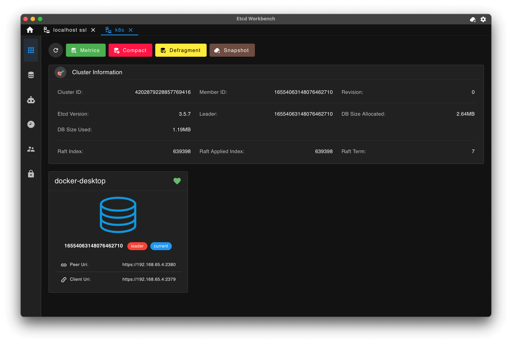

[中文版](./README_ZH.md) | English

   

# Etcd Workbench

A powerful ui client for ETCD v3. Provides App and Web packages. Supports SSL and SSH Tunnel connections.

# Features

1. Completely open-source and free!
2. Available in both desktop app and web versions. The desktop app can be downloaded and installed locally, while the web version can be deployed directly or via docker on a server.
3. Extremely lightweight: the App package is only **5M**, and the Web package is only **15M**.
4. Supports theme switching.
5. Supports multi-connection management.
6. Supports SSL and SSH connections.
7. Supports cluster information viewing, version compaction, data backup, and more.
8. Supports Key-Value editing, multi-language syntax highlighting, and batch import/export.
9. Supports decoding Kubernetes Protobuf format content.
10. Supports comparing multiple versions of Key content.
11. Supports key merge to resolve update conflicts.
12. Supports bookmarking Keys for quick access.
13. Supports key change monitoring and notifications.
14. Supports Key search functionality.
15. Supports lease management: create, delete, Key binding relationships, and countdown display.
16. Supports user management: toggle authentication, create/delete users, grant/revoke roles, etc.
17. Supports role management: create/delete roles, grant/revoke permissions, etc.

- **App**: Includes all features, offers a better experience than the Web version, allows easy data migration, and will receive continuous updates. Recommended for use.
- **Web**: Includes most features, with some exceptions (e.g., data backup). Users can access it directly via a browser without downloading, and it supports multi-user login.

# Download

Visit the [Etcd Workbench homepage](https://tzfun.github.io/etcd-workbench/) to download the latest version. For historical releases, go to [releases](https://github.com/tzfun/etcd-workbench/releases).

- **Desktop App**: Version numbers are prefixed with **App**, e.g., `App-1.0.0`.
    - Supports `windows-x86_64`.
    - Supports `macos-x86_64`.
    - Supports `macos-aarch64`.
- **Web**: Version numbers are prefixed with **Web**, e.g., `Web-1.1.4`.
    - Supports pulling docker images from Docker Hub: [https://hub.docker.com/r/tzfun/etcd-workbench](https://hub.docker.com/r/tzfun/etcd-workbench)
    - Supports docker platforms: `linux/amd64`, `linux/arm64`, `windows/amd64`.

> Note: Versions released on or before May 10, 2024, are Web-only. The first App version was released on August 30, 2024, and follows the new prefix rule.

# Web Deployment

The Web version supports deployment via **Jar** or **Docker**, allowing you to manage Etcd Server in a browser with multi-account login support.

> The Web version has been **archived** and is no longer maintained. For documentation on the Web version, visit the [etcd-workbench-web](https://github.com/tzfun/etcd-workbench-web/) repository.

# App Screenshots

# Development Stack

The frontend is built with Vue, and the backend is built with Rust, ensuring memory safety, low resource consumption, and high performance.

- **Tauri** - App Framework
- **Tokio** - Asynchronous I/O communication
- **etcd-client** - Etcd Connector
- **russh** - SSH Client
- **Vuetify** - UI Framework

# Donate

Your support is the greatest motivation for the developer. Thank you for the coffee🍵!

You can donate via

Or use WeChat Appreciation:

## Donation List (Updated Periodically)
- Machérie - WeChat - ￥30
- whoops - WeChat - ￥12.9
- [8liang](https://github.com/8liang) - WeChat - ￥20
- *Anonymous* - WeChat - ￥5
- [M1NGS](https://github.com/M1NGS) - WeChat - ￥500

# License

[GPL-3.0](LICENSE)