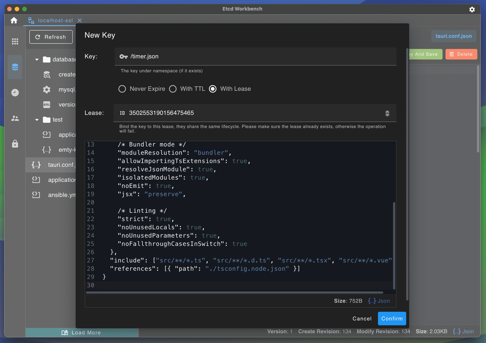

中文版 | [English](./README.md)

   

# Etcd Workbench

一个漂亮、轻量的 ETCD V3 客户端，提供 App 和 Web 版本，支持SSL、SSH Tunnel连接。

# 特点及功能

1. 本工具完全开源免费！
2. 提供 App 和 Web 两个版本，App直接下载安装到本地，Web版本可直接或使用 Docker 部署到服务器
3. 非常轻量，App 包体仅 **5M** ，Web包体仅 **15M**
4. 支持主题切换
5. 支持多连接管理
6. 支持 SSL、SSH 连接
7. 支持集群信息查看、版本压缩、数据备份等功能
8. 支持 Key-Value 编辑、多语言格式高亮、批量导入/导出
9. 支持 Key 多个版本内容比较
10. 支持Key收藏快捷访问
11. 支持Key变化监听与通知
12. 支持 Lease 管理：创建、删除、Key绑定关系、倒计时显示
13. 支持用户管理：开关身份认证功能、用户创建、用户删除、用户授予/回收角色等
14. 支持角色管理：角色创建、角色删除、角色授权/回收权限等

- **App**: 拥有所有功能，相比Web版拥有更好的体验，数据方便迁移，后续将持续更新，推荐使用
- **Web**：拥有大部分功能，少部分功能不支持（例如数据备份等），用户无需下载可使用浏览器直接访问，支持多用户登录。

# 下载

请前往[Etcd Workbench首页](https://tzfun.github.io/etcd-workbench/)下载最新版，如果需要下载历史版本请前往[releases](https://github.com/tzfun/etcd-workbench/releases)。

- App：版本号以 **App** 为前缀，例如 `App-1.0.0`
    - 支持 `windows-x86_64`
    - 支持 `macos-x86_64`
    - 支持 `macos-aarch64`
- Web：版本号以 **Web** 为前缀，例如 `Web-1.1.4`
    - 支持 Docker 平台：`linux/amd64`, `linux/arm64`, `windows/amd64`

> 注：在 2024年5月10日及之前的版本均是Web版，从 2024年8月30日发布的首个App版本开始使用此前缀规则。

# 关于 Web 版

Web 支持 **Jar** 包部署和 **Docker** 部署，在浏览器中管理Etcd Server，支持多账号登录。

> Web版已标记为归档，并不再提供维护更新，关于Web版的使用文档请前往：[etcd-workbench-web](https://github.com/tzfun/etcd-workbench-web/) 仓库。

# App截图

# 技术栈

前端基于 Vue 开发，后端基于 Rust 开发，内存安全、低消耗、高性能

- **Tauri** - App Framework
- **Tokio** - 异步IO通信
- **etcd-client** - Etcd Connector
- **Vuetify** - UI框架

# License

[Apache License 2.0](LICENSE)