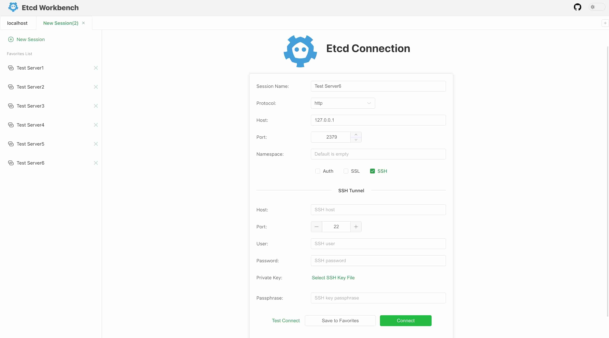
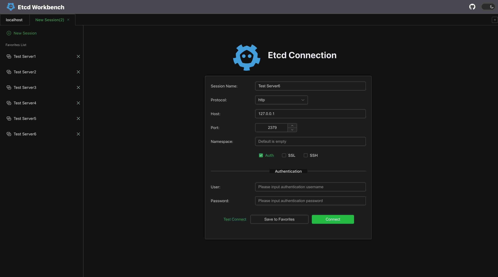
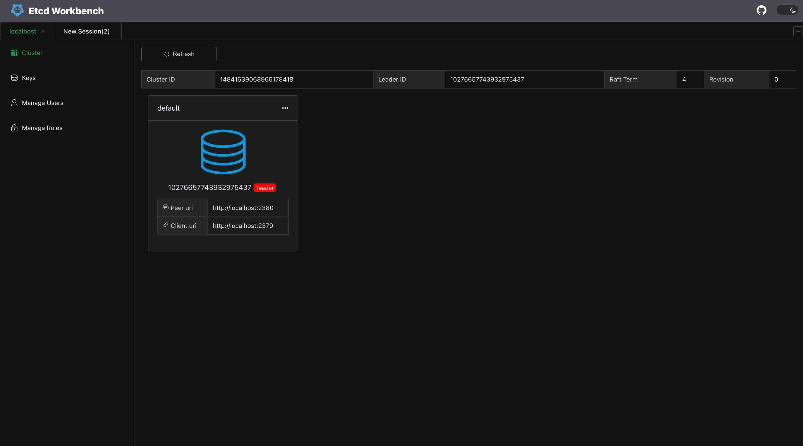
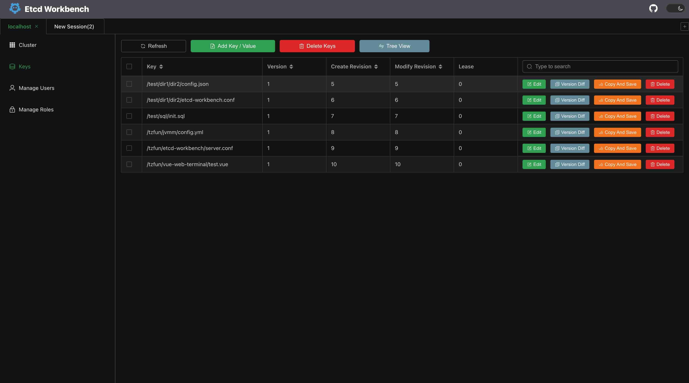
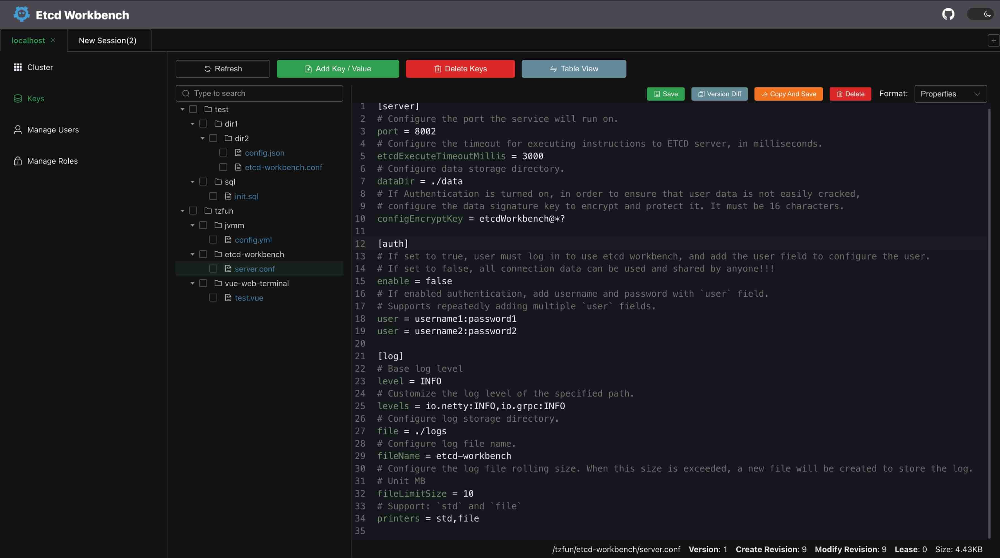
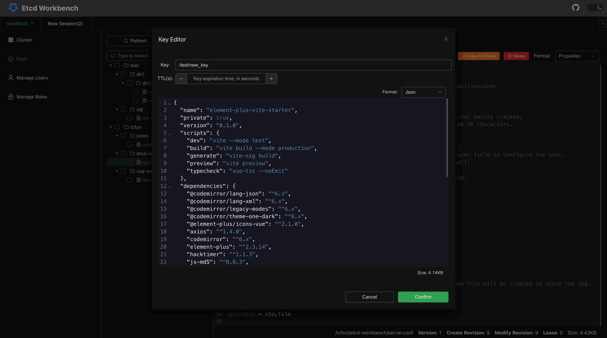
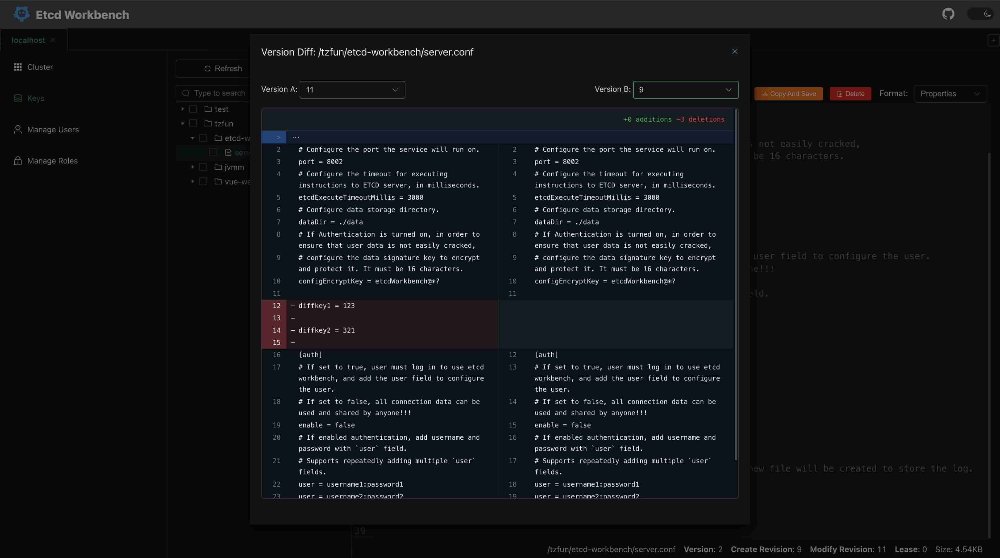
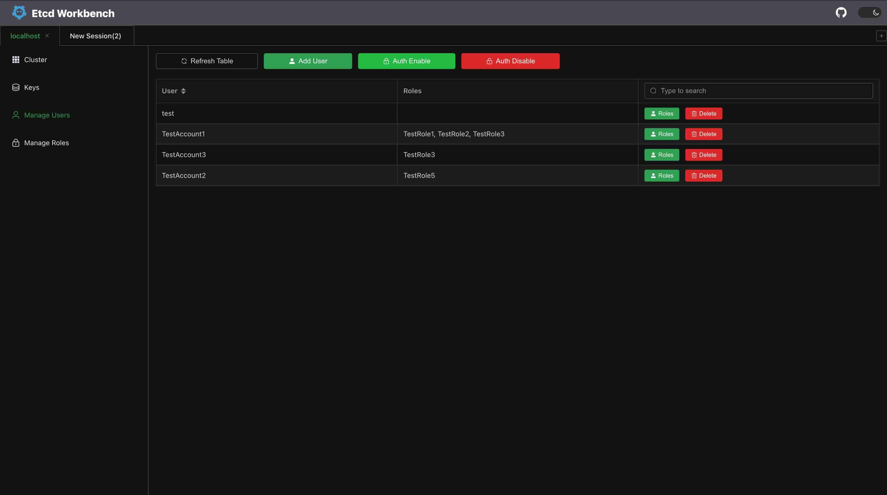
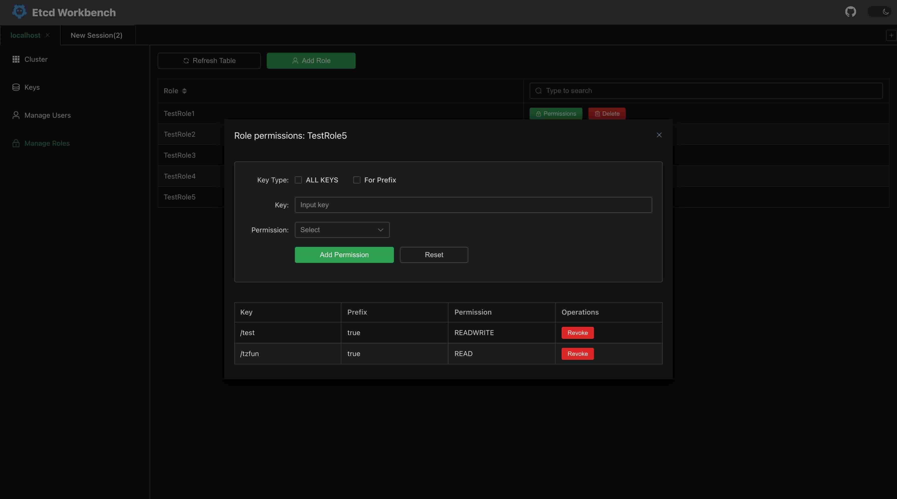

中文版 | [English](./README.md)

<div align=center>

</div>

# Etcd Workbench

一个漂亮的、轻量的、可私有化部署的 ETCD 客户端，支持SSL、SSH Tunnel连接，支持多账户 session 管理。

# 为什么选择它？

1. 官方的客户端工具支持功能少，在线编辑效果差，本工具提供了SSH tunnel、在线代码编辑、版本对比、快捷复制等功能，让配置中心管理更高效！
2. 大部分好用的第三方工具需要收费，扎了免费党的心💔
3. 本工具完全开源免费！

# 快速体验

## Demo

访问 [http://etcd.beifengtz.com](http://etcd.beifengtz.com)

* 测试账号：test
* 测试密码：test

> **注意** 该测试客户端仅用作展示，请不要在其中保存真实的连接信息，保存的信息将会对所有登录test账号的人公开，
> Demo不会保留以及记录所有连接信息，但为避免你的连接信息泄露，请使用测试ETCD地址，或者使用私有化部署体验。

## 私有部署

首先需确保你的本地环境拥有 JDK 11及以上的版本，下载最新的 jar 包后执行：

```shell
java -jar etcd-workbench.jar
```

浏览器中访问`http://localhost:8002`

# 私有部署文档

## 配置文件

部署的配置很简单，仅需一个配置文件，并且配置内容也非常少。

etcd-workbench.conf
```ini
[server]
# Configure the port the service will run on.
port = 8002
# Configure the timeout for executing instructions to ETCD server, in milliseconds.
etcdExecuteTimeoutMillis = 3000
# Configure data storage directory.
dataDir = ./data
# If Authentication is turned on, in order to ensure that user data is not easily cracked,
# configure the data signature key to encrypt and protect it. It must be 16 characters.
configEncryptKey = etcdWorkbench@*?

[auth]
# If set to true, user must log in to use etcd workbench, and add the user field to configure the user.
# If set to false, all connection data can be used and shared by anyone!!!
enable = false
# If enabled authentication, add username and password with `user` field.
# Supports repeatedly adding multiple `user` fields.
user = username1:password1
user = username2:password2

[log]
# Base log level
level = INFO
# Customize the log level of the specified path.
levels = io.netty:INFO,io.grpc:INFO
# Configure log storage directory.
file = ./logs
# Configure log file name.
fileName = etcd-workbench
# Configure the log file rolling size. When this size is exceeded, a new file will be created to store the log.
# Unit MB
fileLimitSize = 10
# Support: `std` and `file`
printers = std,file
```

## 本地部署

首先需确保你的本地环境拥有 **JDK 11+** 的版本，下载最新的 jar 包，将配置文件 `etcd-workbench.conf` 放到和 jar 包同级目录即可生效，执行启动：

```shell
java -jar etcd-workbench.jar
```

浏览器中访问`http://localhost:8002`

## Docker中部署

Docker hub仓库地址：[https://hub.docker.com/r/tzfun/etcd-workbench](https://hub.docker.com/r/tzfun/etcd-workbench)

拉取Docker镜像

```shell
docker pull tzfun/etcd-workbench
```

启动容器

```shell
docker run \
    --name my-etcd-workbench \
    -p 8002:8002 \
    -v ./etcd-workbench.conf:/usr/tzfun/etcd-workbench/etcd-workbench.conf \
    -d \
    tzfun/etcd-workbench:latest
```

镜像的工作目录在 `/usr/tzfun/etcd-workbench`，其目录结构如下

```
/usr/tzfun/etcd-workbench # tree
├── bin
├── data
├── logs
├── temp
├── etcd-workbench.conf
└── etcd-workbench.jar
```

# 截图

本工具提供黑色和白色两种主题




集群管理


Key管理


提供树状试图


Key编辑器


支持版本对比


用户管理


角色管理



# License

[Apache License 2.0](LICENSE)