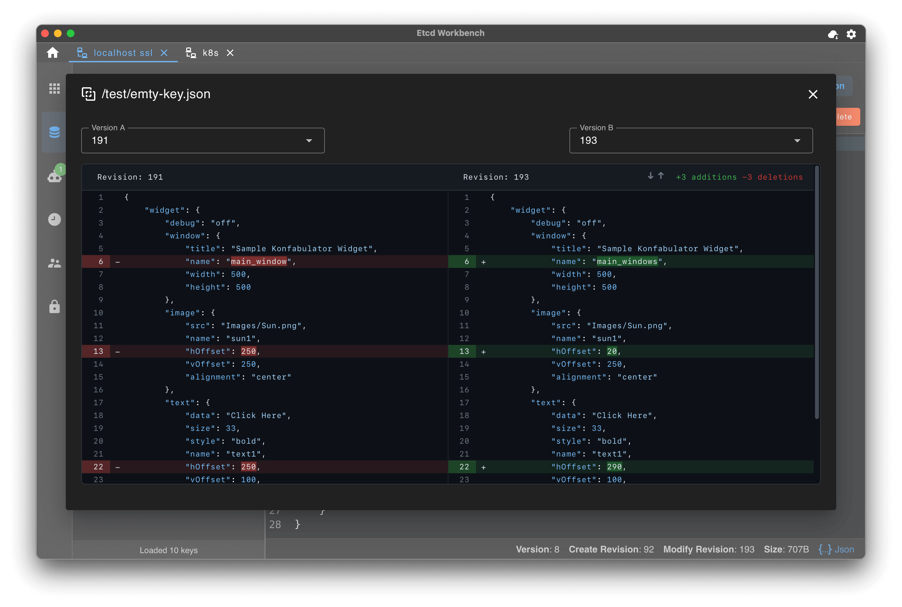
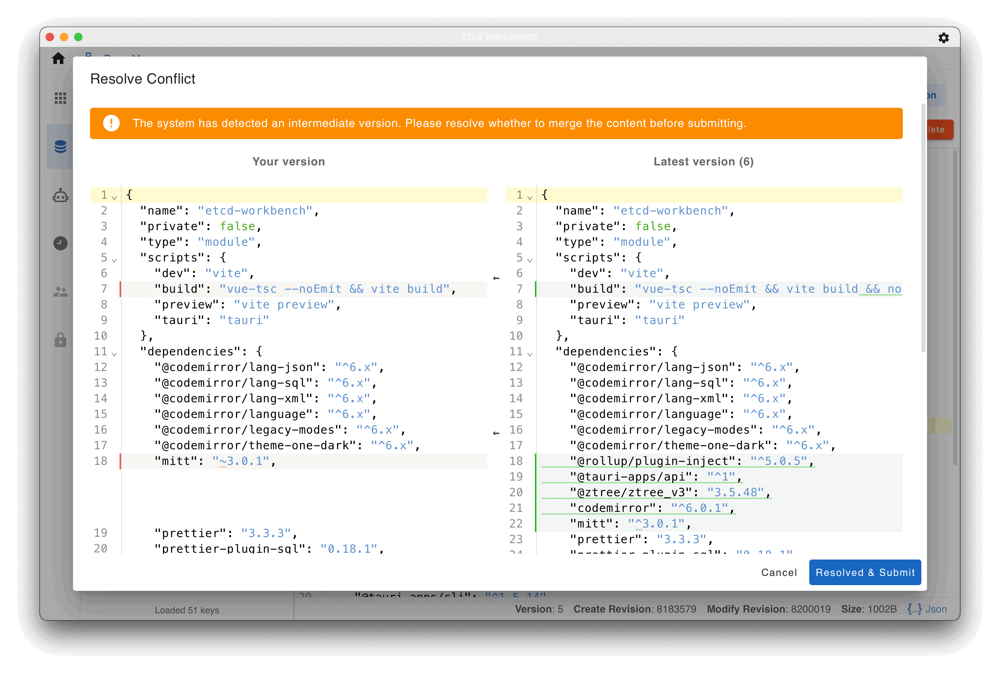
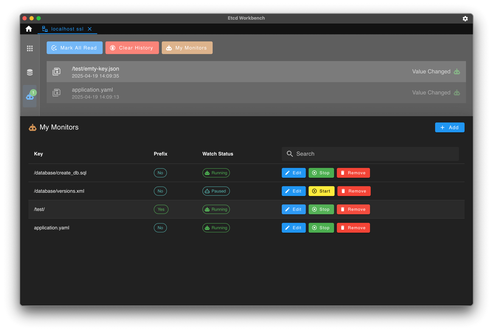
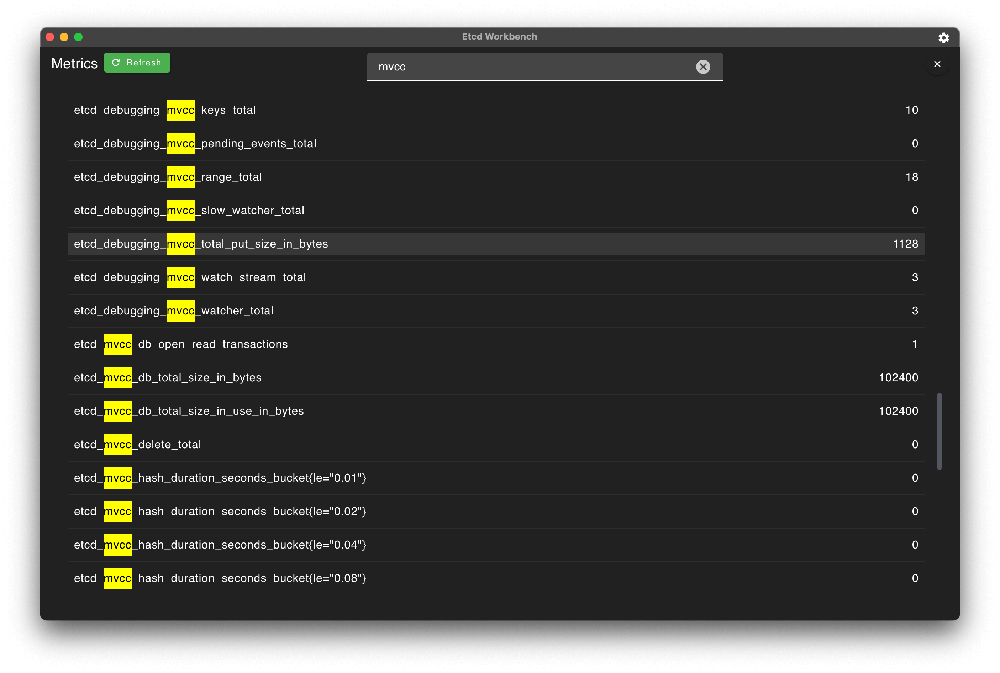

中文版 | [English](./README.md)

   

# Etcd Workbench

一个功能强大的 ETCD V3 客户端，提供 App 和 Web 版本，支持SSL、SSH Tunnel连接。

# 特点及功能

1. 本工具完全开源免费！
2. 提供 App 和 Web 两个版本，App直接下载安装到本地，Web版本可直接或使用 Docker 部署到服务器
3. 非常轻量，App 包体仅 **5M** ，Web包体仅 **15M**
4. 支持主题切换
5. 支持本地化多语言
6. 支持多连接管理
7. 支持 SSL、SSH 连接
8. 支持集群信息查看、版本压缩、数据备份等功能
9. 支持 Key-Value 编辑、多语言格式高亮、批量导入/导出
10. 支持 Kubernetes 的 Protobuf 格式内容解码
11. 支持 Key 多个版本内容比较
12. 支持 Key Merge解决更新冲突
13. 支持 Key 路径自动补全
14. 支持Key收藏快捷访问
15. 支持Key变化监听与通知
16. 支持Key搜索功能
17. 支持 Lease 管理：创建、删除、Key绑定关系、倒计时显示
18. 支持用户管理：开关身份认证功能、用户创建、用户删除、用户授予/回收角色等
19. 支持角色管理：角色创建、角色删除、角色授权/回收权限等

- **App**: 拥有所有功能，相比Web版拥有更好的体验，数据方便迁移，后续将持续更新，推荐使用
- **Web**：拥有大部分功能，少部分功能不支持（例如数据备份等），用户无需下载可使用浏览器直接访问，支持多用户登录。

# 下载

请前往[Etcd Workbench首页](https://tzfun.github.io/etcd-workbench/)下载最新版，如果需要下载历史版本请前往[releases](https://github.com/tzfun/etcd-workbench/releases)。

- App：版本号以 **App** 为前缀，例如 `App-1.0.0`
    - 支持 `windows-x86_64`
    - 支持 `macos-x86_64`
    - 支持 `macos-aarch64`
- Web：版本号以 **Web** 为前缀，例如 `Web-1.1.4`
    - 从DockerHub下载镜像：[https://hub.docker.com/r/tzfun/etcd-workbench](https://hub.docker.com/r/tzfun/etcd-workbench)
    - 支持 Docker 平台：`linux/amd64`, `linux/arm64`, `windows/amd64`

> 注：在 2024年5月10日及之前的版本均是Web版，从 2024年8月30日发布的首个App版本开始使用此前缀规则。

# 关于 Web 版

Web 支持 **Jar** 包部署和 **Docker** 部署，在浏览器中管理Etcd Server，支持多账号登录。

> Web版已标记为归档，并不再提供维护更新，关于Web版的使用文档请前往：[etcd-workbench-web](https://github.com/tzfun/etcd-workbench-web/) 仓库。

# App截图

# 技术栈

前端基于 Vue 开发，后端基于 Rust 开发，内存安全、低消耗、高性能

- **Tauri** - App Framework
- **Tokio** - 异步IO通信
- **etcd-client** - Etcd Connector
- **russh** - SSH连接
- **Vuetify** - UI框架

# 捐赠

你的支持是作者开发最大的动力，感谢你请的coffee🍵！

你可以在
中捐赠

也可以使用微信赞赏捐赠

## 捐赠列表（不定期更新）
- Machérie - 微信 - 30元
- whoops - 微信 - 12.9元
- [8liang](https://github.com/8liang) - 微信 - 20元
- *匿名* - 微信 - 5元
- [M1NGS](https://github.com/M1NGS) - 微信 - 500元
- kai - 微信 - 8元
- [fpzhang928](https://github.com/fpzhang928) - 微信 - 30元

# License

[GPL-3.0](LICENSE)